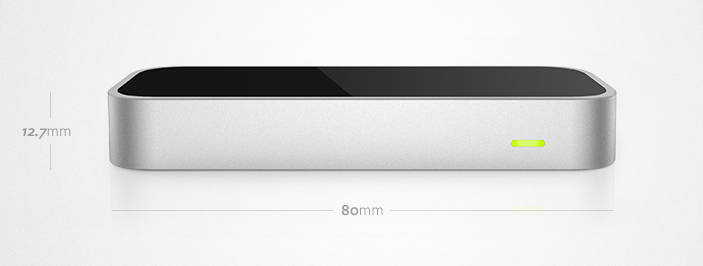
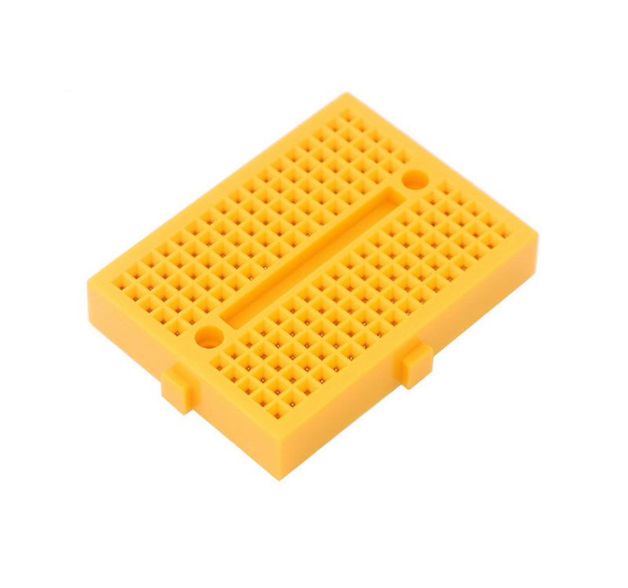
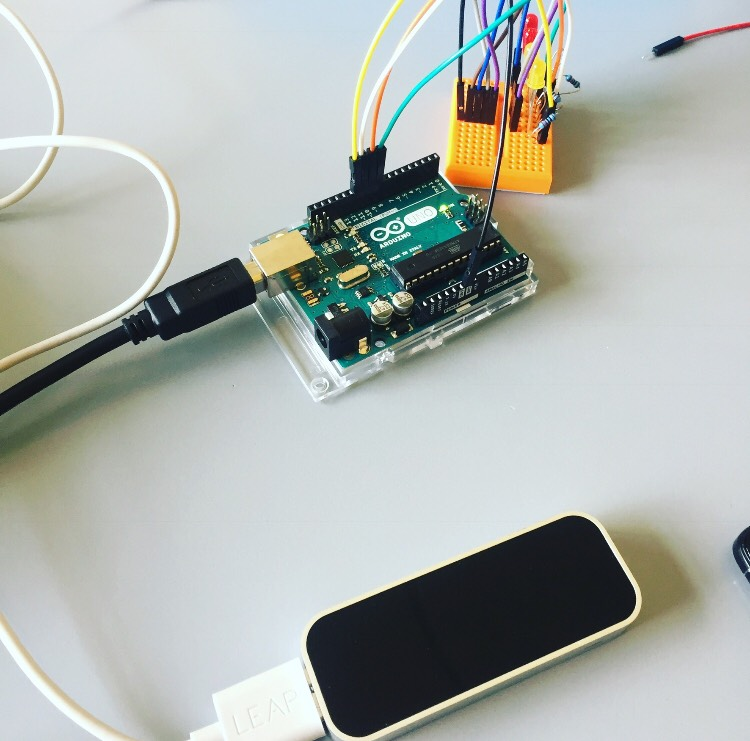
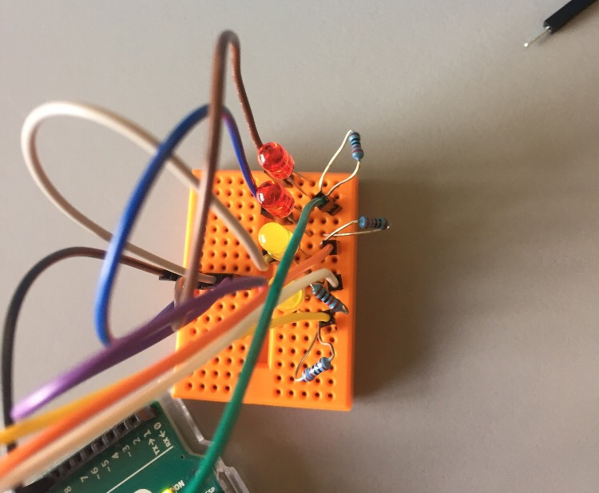
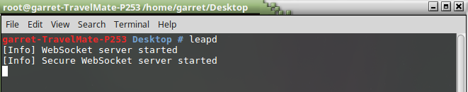
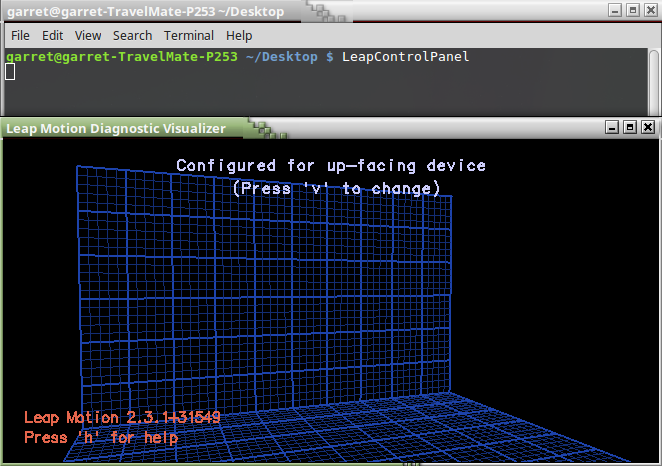

[](http://hits.dwyl.com/{username}/{project-name})
[](https://shields.io/)

[](https://travis-ci.org/anfederico/Clairvoyant)
### **_Members_**
- [Alan Heanue](https://github.com/heanuea)
- [Garret Tonra](https://github.com/gtonra89)

## **_Brief_**
Develop an application with a Natural User Interface. You have a choice of technologies available to you and an opportunity 
to combine a lot of technology that you have worked with over the past four years.

## **_Research and Concepts_**
So we had a lot of choice in this project and a lot of freedom we had to work in pairs so we both had Rasberry pis but were not to sure to do with them. 
The college had a range of tech that we could have used for example they had [Kinect](https://en.wikipedia.org/wiki/Kinect) , [Myo Armband](https://www.myo.com/) , [Leap motiom](https://www.leapmotion.com/) 
and also we did in lab tutorials in how to work with [Cortona](https://en.wikipedia.org/wiki/Cortana). But we wanted something where we can use the rasberry pi or even an adruino as students we didnt want to invest to much in buying much gear for that like a camera or screen for the pi, we decided to use the Leap motion.

**concept one**
- Was to use leap motion with the rasberry pi work between them was going to a stream and than an adruino to connect with 2 servos 


**concept Two**
- We decided to drop the Rasberri pi as there was a lot of work with the stream to connect time was not our side so we decided to for a leap to adruino with a breadboard circuit with LED lights attached. 


## **_OverView_**
The Project involves the leap motion and connecting it with the Arduino Using Node Js Librarys Running a few commands this will lead to hand gestures from the leap motion 
and sending a signal to a circuit board with led lights that change color with the different gestures. 
There is a video demo of the project below. 
 

## **_Technology Used_**
Here is some of technologys we are using You will need to download the Following.

### **_Motion Leap_**
The Leap Motion controller is a small USB peripheral device which is designed to be placed on a physical desktop, facing upward. It can also be mounted onto a virtual reality headset. Using two monochromatic IR cameras and three infrared LEDs, the device observes a roughly hemispherical area, to a distance of about 1 meter. The LEDs generate pattern-less IR light and the cameras generate almost 200 frames per second of reflected data.
This is then sent through a USB cable to the host computer, where it is analyzed by the Leap Motion software using "complex maths" in a way that has not been disclosed by the company, in some way synthesizing 3D position data by comparing the 2D frames generated by the two cameras.In a 2013 study, the overall average accuracy of the controller was shown to be 0.7 millimeters.


The smaller observation area and higher resolution of the device differentiates the product from the Kinect, which is more suitable for whole-body tracking in a space the size of a living room. In a demonstration to CNET, the controller was shown to perform tasks such as navigating a website, using pinch-to-zoom gestures on maps, high-precision drawing, and manipulating complex 3D data visualizations.

Leap Motion initially distributed thousands of units to developers who are interested in creating applications for the device. The Leap Motion controller was first shipped in July 2013.In February 2016, Leap Motion released a major beta update to its core software. Dubbed Orion, the software is designed for hand tracking in virtual reality.

Here are the some of the Gestures you can do with Leap 


**Here is the procedure to install the Leap Motion SDK in Linux**
- Download the SDK from https://www.leapmotion.com/setup/linux; you can extract this package and you will find two DEB files that can be installed on Linux.
- Open Terminal on the extracted location and install the DEB file using the following command (for 64-bit PCs):

```
$ sudo dpkg -install leap-*-x64.deb
```
**_for more about downloading Leap Motion visit_**
- https://developer.leapmotion.com/unity/#116


### **_Arduino_**
========

* Arduino is an open-source physical computing platform based on a simple I/O
board and a development environment that implements the Processing/Wiring
language.

Arduino can be used to develop stand-alone interactive objects or
can be connected to software on your computer (e.g. Flash, Processing and MaxMSP).
The boards can be assembled by hand or purchased preassembled; the open-source
IDE can be downloaded for free at https://www.arduino.cc/en/Main/Software


Installation
------------
1. Flash the Arduino with StandardFirmata: 
2. Run ``Node arduino.js``

Configuring Leap & Arduino
------------


Detailed instructions for installation in popular operating systems.  
For Linux: https://www.arduino.cc/en/Guide/Linux (see also the Arduino playground page https://playground.arduino.cc/Learning/Linux)   
For macOS X: https://www.arduino.cc/en/Guide/MacOSX   
For Windows: https://www.arduino.cc/en/Guide/Windows


### **_BreadBoard Circuit_**

Breadboard is retangular piece of plastic with a grid of holes that allows you to easily and quickly build an electronic circuits by pushing electronic components into the holes. Here is a similar one to one we used.

This is a mini Breadboard above the holes of a breadboard allow you to easilt=y push the leads, or metal legs which in our case are LED to hold them into place. This is soulderless breadboard as we dont need to soulder components together. There is also no bus row as we dont extra voltage or power going thrugh the board. 


## **_Components put together_**




## **_How To Run_**
1. Install [nodejs](http://www.nodejs.org/)
2. Run ``npm install``
3. Install [cylonjs](https://cylonjs.com), a robotics javascript framework.
4. Install Leap motion SDK
5. With NPM Install download the Following ``Cylon, cylon-firmata, and cylon-leapmotion.``

## **_When Files and packages are fully downloaded here are the terminal commands_**
1. Open a CMD window with administration Privaleges or as Root CMD and type ``leapd`` this will Launch the leapmotion Daemon
you should get a notification status saying the Daemon is running.



2. Open another CMD window and type ``LeapControlPanel`` - This will show up the LeapMotion Control Panel where the visualiser is situated.



3. Finally open a Third CMD window and change directory to the downloaded & extracted repository once inside the repo type the folowing to run the project `` node gesture.js `` the program should load and the console will log any gesture movements declared in fromt of the leap-motion.


## **_Code_**
```javascript
"use strict";

var Cylon = require("cylon");

var fade = 1;
var brightness = 0;

Cylon.robot({

  connections: {
      leapmotion: { adaptor: "leapmotion" },
      arduino: { adaptor: "firmata", port: "//dev/ttyACM0" } //dev/ttyACM0
  },
    //assign devices pinouts
    devices: {
      led11: { driver: "led", pin: 11, connection: "arduino" },
      led10: { driver: "led", pin: 10, connection: "arduino" },
      led9: { driver: "led", pin: 9, connection: "arduino" },
      led8: { driver: "led", pin: 8, connection: "arduino" },
      leapmotion: { driver: 'leapmotion' }
    },

  work: function(my) {
    my.leapmotion.on('frame', function(frame) {
      // if (frame.hands.length > 0) {
      var gest = frame.data.gestures;
      gest.forEach(function (gesture) {
        switch(gesture.type) {
          case "circle":
              //console.log("Circle Gesture");
              switch (gesture.state){
                case "start":
                    console.log("Turning led11 On for Circle start");
                    brightness = 0;
                    my.led11.turnOn();
                    break;
                case "update":
                    if (brightness === 0) { fade = 1;} else if (brightness === 255) { fade = -1; }
                    console.log("Turning led11 brightness from: " + my.led11.currentBrightness());
                    brightness += fade;
                    my.led11.brightness(brightness);
                    console.log("to: " + my.led11.currentBrightness());
                    if (brightness === 0) { fade = 1;} else if (brightness === 255) { fade = -1; }
                    break;
                case "stop":
                    console.log("Turning led11 Off for Circle stop");
                    my.led11.turnOff();
                    my.led11.brightness(0);
                    break;
              }
              break;
          case "keyTap":
              console.log('Toggling led10 for keyTap Gesture');
              my.led10.toggle();
              break;
          case "screenTap":
              console.log('Toggling led9 for screenTap Gesture');
              my.led9.toggle();
              break;
          case "swipe":
              switch (gesture.state){
                case "start":
                    console.log("Turning led8 On for Swipe start");
                    my.led8.turnOn();
                    break;
                case "stop":
                    console.log("Turning led8 Off for Swipe stop");
                    my.led8.turnOff();
                    break;
              }
              break;
        }
      });
    });
  }
    
}).start();

```
**_connect to Adruino_**

```javascript

/*
 * This Source Code Form is subject to the terms of the Mozilla Public
 * License, v. 2.0. If a copy of the MPL was not distributed with this
 * file, You can obtain one at http://mozilla.org/MPL/2.0/.
 *
 * Copyright (c) 2014, Decoded Ltd dev@decoded.com
 */

// grab the leap data
var webSocket = require('ws'),
    ws = new webSocket('ws://127.0.0.1:6437'),
    five = require('johnny-five'),
    board = new five.Board(),
    led, frame;

// switch led on when both hands present, otherwise off
board.on('ready', function() {
    led = new five.Led(13);
    ws.on('message', function(data, flags) {
        frame = JSON.parse(data);
        if (frame.hands && frame.hands.length == 1) {
            led.on();
        } else {
            led.off();
        }
    });

```
## **_Presentation_**
check in files its under  Lookbook

## **_Video_**
<a href="https://imgflip.com/gif/27zuhr"></a>

## **_Conclusion_**
This Project was a lot of fun we started out both having rasberri pis but the first idea or concept we had planned we ran into alot of issues with a server or service to connect the leap and rasberri pi.
It also had alot of parts we needed to get and we didnt have time and money to go ahead we scrapped that plan and downsized it as we had the leap a very powerful tool all we needed was a few leds and a arduino. 
Putting the whole project was very fun had to read into a small bit to electronics but Garret had knowledge of that so he put together the circuit board and Arduino we used Linux os to run the whole project, as 
it was easier to configure the arduino. The leapmotion needed more attention on linux as it ws not as straight forward to set configure. Eventully when we got all the hardware pieced together we than had get them talking to each other that we had to do a bit of research and we found that there ws alot out there for arduino, some of the research for leap was a bit dated but still worked aftere getting them talking we had to code the gestures to turn on lights and assign a gesture to a certain LED. We spent a good week and half playing around with the technology and we are delighted with the results.

## **_References_**
- http://blog.leapmotion.com/hardware-to-software-how-does-the-leap-motion-controller-work/
- https://en.wikipedia.org/wiki/Leap_Motion
- https://cylonjs.com/documentation/platforms/arduino/
- https://developer.leapmotion.com/documentation/cpp/api/Leap_Classes.html
- https://stackoverflow.com/questions/35622933/how-to-specify-registry-while-doing-npm-install-with-git-remote-url
- https://docs.npmjs.com/cli/install
- https://cylonjs.com/documentation/examples/cylon/annotated/leap_arduino/

